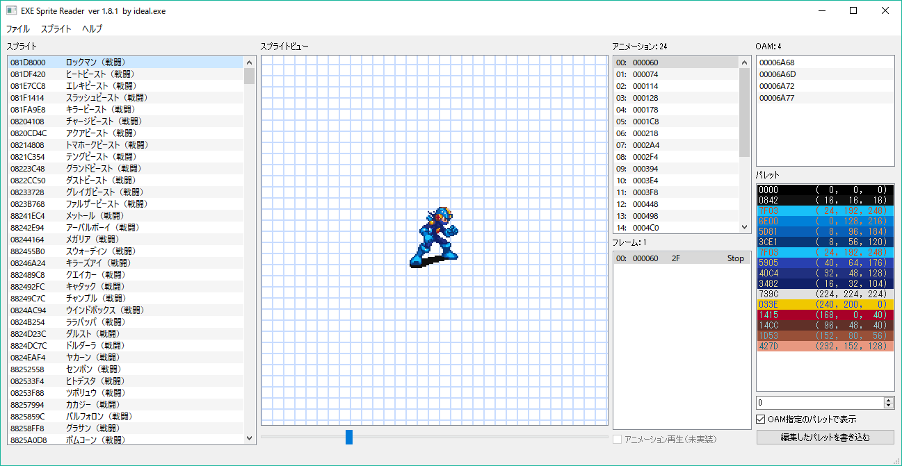

# EXE Sprite Reader

## 概要
ロックマンエグゼのスプライトを閲覧・編集できるツールです。

## 説明
* 対応しているROM内のスプライトデータやダンプしたスプライトを閲覧・編集できます。
* スプライト差し替えのための便利な機能がついています。

## 使用方法
### 起動
* `>python EXESpriteReader.py`でGUIが起動します。
* `-f`オプションで開くROMファイルを指定できます。
